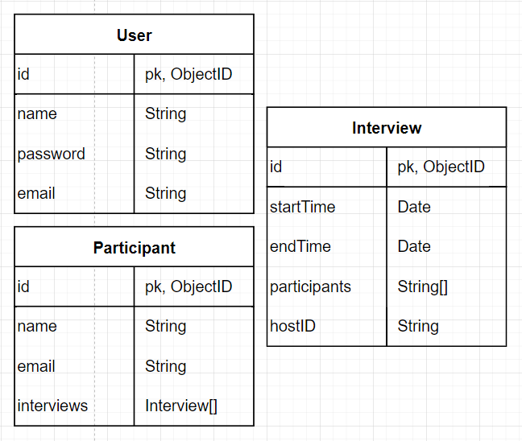

# Interview-Creation-Portal

Live Link: [Interview Creation Portal](https://www.holdmypotion.tech/)

## Description

Create a simple app where admins can create interviews by selecting participants, interview start time and end time

## Basic Requirements - From Client

1. An interview creation page where the admin can create an interview by selecting participants, start time and end time. Backend should throw error with proper error message if:
   1. Any of the participants is not available during the scheduled time (i.e, has another interview scheduled)
   2. No of participants is less than 2
2. An interviews list page where admin can see all the upcoming interviews.
3. An interview edit page where admin can edit the created interview with the same validations as on the creation page.

_Note: No need to add a page to create Users/Participants. Create them directly in the database_

## Tech Stack (MERN)

1. React framework
2. NodeJS
3. ExpressJS
4. MongoDB / Mongoose
5. Docker
6. Kubernetes
7. Jest

## Hosting Provider

Digital Ocean - Kubernetes Cluster

## Functional Requirements

- An interviewer creates an interview including themselves and at least one other participant.

- An interviewer can create any number of interviewees and setup any number of interviews for each and all participants

- An interview can have any number of participants (including a single interviewer and multiple interviewees),
  start time and end time (in military time)

- After selecting all the participants, the interviewer sets the time slot for the interview
  (based on the intersection of available time for all the participants)

- An interviewer can view all the upcoming interviews

- An interviewer can edit an interview (similar interface as creation page)

- On successful interview creation, all participants get an invitation email.

## EndPoints


#


## Database Schema



## Running Development Server

1. [Setup Docker with Kubernetes](https://www.docker.com/products/docker-desktop)
2. Install OS Specific [NGINX Ingress Controller](https://kubernetes.github.io/ingress-nginx/deploy/)
3. Install OS Specific [Skaffold](https://skaffold.dev/docs/install/)
4. Run `skaffold dev`

## Running Jest Test Framework

```sh
npm test
```
